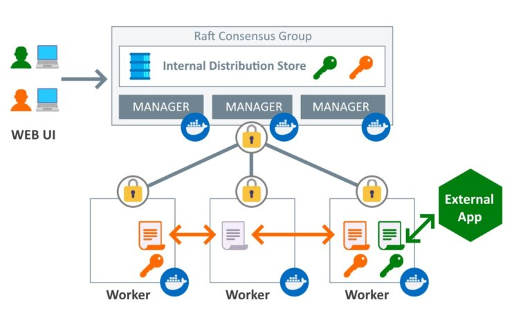

## Secret (Donnée sensible)
Disponible dans le container à l'exécution '/run/secrets/'




### Exemple:
```
node1@:$ echo "my_password" | docker secret create password -
```

```
node1@:$ $ docker service create --name=www --secret=password nginx:1.14.0-alpine                                                                                                   
=>
x9lr33s4ln8syzq5kvsa3fbht
overall progress: 1 out of 1 tasks 
1/1: running   [==================================================>] 
verify: Service converged 
```

Si on lance un shell dans le conteneur, on peut voir le secret en clair dans le fichier /run/secrets/password.
```
node1@:$ docker exec -ti <ID_CONTAINER> sh
# cat /run/secrets/password 
my_password 
```

Si on met le service à jour et qu'on lui enlève l'accès aux secrets "password"
```
node1@:$ docker service update --secret-rm="password" www                                                                                                                         
=>
www
overall progress: 1 out of 1 tasks 
1/1: running   [==================================================>] 
verify: Service converged 
```

il n'est plus disponible dans le container du service.
```
node1@:$ docker exec -ti <ID_CONTAINER> sh                                                                                                                                                  
# cat /run/secrets/password
cat: can't open '/run/secrets/password': No such file or directory
```