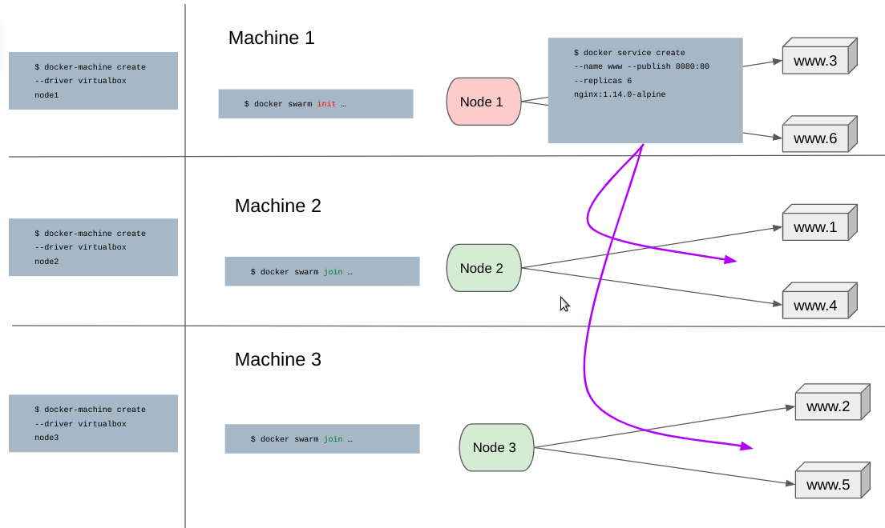
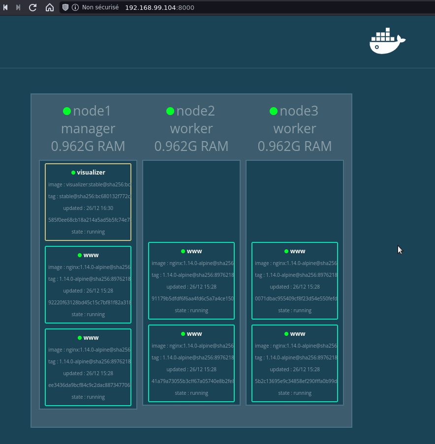

# Architecture



## Création du swarm


### Docker Machine
Il faudra installer docker-machine, les instructions sont détaillées à l'adresse https://docs.docker.com/machine/install-machine/

installer virtualbox
```
$ sudo apt update && apt upgrade && apt install virtualbox
```

créer 3 hôtes nommés node1, node2, node3
```
$ docker-machine create --driver virtualbox node1
$ docker-machine create --driver virtualbox node2
$ docker-machine create --driver virtualbox node3
```

```
$ docker-machine ls
NAME    ACTIVE   DRIVER       STATE     URL                         SWARM   DOCKER      ERRORS
node1   -        virtualbox   Running   tcp://192.168.99.104:2376           v19.03.12   
node2   -        virtualbox   Running   tcp://192.168.99.105:2376           v19.03.12   
node3   -        virtualbox   Running   tcp://192.168.99.106:2376           v19.03.12   
```

Connecter en ssh sur node1
```
$ docker-machine ssh node1
```

Nous pouvons ensuite initialiser le swarm
```
node1@:$ docker swarm init --advertise-addr <IP_NETWORK_INTERFACE_NODE_1>
=>
Swarm initialized: current node (5nss4dyj77x2wjwdbc2gsiet1) is now a manager.
To add a worker to this swarm, run the following command:

    docker swarm join --token SWMTKN-1-1272f6pr1yzpnl9u5xbv0pp8afk5w3b4io37sdy96bu18emoen-6kak95x0gwu4j7v63eopc0do9 192.168.99.100:2377

To add a manager to this swarm, run 'docker swarm join-token manager' and follow the instructions.
```
Le daemon Docker du node1 est maintenant en Swarm mode.

Lister les nodes de notre cluster
```
node1@:$ docker node ls
=>
ID                            HOSTNAME            STATUS              AVAILABILITY        MANAGER STATUS      ENGINE VERSION
5nss4dyj77x2wjwdbc2gsiet1 *   node1               Ready               Active              Leader              19.03.12
```

### Ajouter des workers
Depuis les 2 autres terminaux (node2, node3) , nous lançons la commande docker swarm join... obtenue lors de l’initialisation du Swarm.

```
$ docker-machine ssh node2
node2@:$ docker swarm join --token SWMTKN-1-1272f6pr1yzpnl9u5xbv0pp8afk5w3b4io37sdy96bu18emoen-6kak95x0gwu4j7v63eopc0do9 192.168.99.100:2377
=> This node joined a swarm as a worker.
```

```
$ docker-machine ssh node3
node3@:$ docker swarm join --token SWMTKN-1-1272f6pr1yzpnl9u5xbv0pp8afk5w3b4io37sdy96bu18emoen-6kak95x0gwu4j7v63eopc0do9 192.168.99.100:2377
=> This node joined a swarm as a worker.
```

Depuis le node1, nous pouvons alors lister les nodes présents dans notre cluster:
```
node1@:$ docker node ls
=>                                                                                                                                                         
ID                            HOSTNAME            STATUS              AVAILABILITY        MANAGER STATUS      ENGINE VERSION
5nss4dyj77x2wjwdbc2gsiet1 *   node1               Ready               Active              Leader              19.03.12
ihslg48h3zdeh5bzrl3m0nhz0     node2               Ready               Active                                  19.03.12
kn6oxtw6sup3jjq345b4dtg05     node3               Ready               Active                                  19.03.12
```

### Service

- --replicas: Le nombre de réplicas correspond au nombre de tâches qui seront instanciées pour ce service.\
Chaque tâche lancera un container basée sur l’image définie dans le service.

```
@node1:$ docker service create --name www --publish 8080:80 --replicas 6 nginx:1.14.0-alpine
=>
ipx7kqhsyfc1vubazi1nx9wpo
overall progress: 6 out of 6 tasks 
1/6: running   [==================================================>] 
2/6: running   [==================================================>] 
3/6: running   [==================================================>] 
4/6: running   [==================================================>] 
5/6: running   [==================================================>] 
6/6: running   [==================================================>] 
verify: Service converged 
```

Lister les tâches du service 'www'
```
@node1:$ docker service ps www  
=>                                                                                                                                                  
ID                  NAME                IMAGE                 NODE                DESIRED STATE       CURRENT STATE           ERROR               PORTS
l09nj1dx1zss        www.1               nginx:1.14.0-alpine   node2               Running             Running 2 minutes ago                       
bls0oftwfpxw        www.2               nginx:1.14.0-alpine   node3               Running             Running 2 minutes ago                       
phgu9z86l5qb        www.3               nginx:1.14.0-alpine   node1               Running             Running 2 minutes ago                       
fdg93ipsixvo        www.4               nginx:1.14.0-alpine   node2               Running             Running 2 minutes ago                       
q0gemu6kmdm1        www.5               nginx:1.14.0-alpine   node3               Running             Running 2 minutes ago                       
1vmqlvasuiso        www.6               nginx:1.14.0-alpine   node1               Running             Running 2 minutes ago                       
```
Le service publie le port 80 sur le port 8080 du swarm (routing mesh).\
Cela signifie que le service www sera accessible depuis le port 8080 de chaque node du cluster(node1, node2, node3).\
Quelque soit le node sur lequel la requête est envoyée, nous aurons accès à l'interface de l'application nginx.

Vérifions cela:

Node 1: http://192.168.99.104:8080
```
@node1:$ docker container ls
=>
CONTAINER ID        IMAGE                 COMMAND                  CREATED             STATUS              PORTS               NAMES
ee3436da9bcf        nginx:1.14.0-alpine   "nginx -g 'daemon of…"   19 minutes ago      Up 19 minutes       80/tcp              www.6.1vmqlvasuisowphy3gwvobapk
92220f63128b        nginx:1.14.0-alpine   "nginx -g 'daemon of…"   19 minutes ago      Up 19 minutes       80/tcp              www.3.phgu9z86l5qb5a9sebmwogefv
```

Node 2: http://192.168.99.105:8080
```
@node2:$ docker container ls
=>
CONTAINER ID        IMAGE                 COMMAND                  CREATED             STATUS              PORTS               NAMES
41a79a73055b        nginx:1.14.0-alpine   "nginx -g 'daemon of…"   19 minutes ago      Up 19 minutes       80/tcp              www.4.fdg93ipsixvod6lrp3vwiavhg
91179b5dfdf6        nginx:1.14.0-alpine   "nginx -g 'daemon of…"   19 minutes ago      Up 19 minutes       80/tcp              www.1.l09nj1dx1zss1nhme1sbwsv1v
```

Node 3: http://192.168.99.106:8080
```
@node3:$ docker container ls
=>
CONTAINER ID        IMAGE                 COMMAND                  CREATED             STATUS              PORTS               NAMES
5b2c13695e9c        nginx:1.14.0-alpine   "nginx -g 'daemon of…"   18 minutes ago      Up 18 minutes       80/tcp              www.2.bls0oftwfpxw47ahi3xio0z5y
0071dbac9554        nginx:1.14.0-alpine   "nginx -g 'daemon of…"   18 minutes ago      Up 18 minutes       80/tcp              www.5.q0gemu6kmdm1lxtks21332qoh
```


## Service de visualisation

```
@node1:$ docker service create \
  --name visualizer \
  --mount type=bind,source=/var/run/docker.sock,destination=/var/run/docker.sock \
  --constraint 'node.role == manager' \
  --publish "8000:8080" dockersamples/visualizer:stable

```

Node 1: http://192.168.99.104:8000


