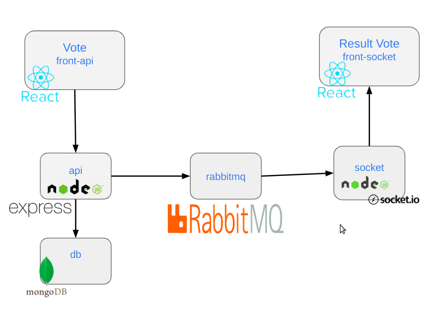

## Architecture

- front-api: front-end permettant à un utilisateur de voter.
- api: back-end réceptionnant les votes.
- front-socket: front-end permettant de visualiser les résultats.
- socket: back-end mettant à disposition les résultats
- db: database dans laquelle sont stockés les votes
- rabbitmq: broker de messagerie qui récupère les votes depuis api et transmet les résultats à la partie socket.



```
├── docker-compose.yml
├── api
│   ├── API-voting.postman_collection.json
│   ├── app
│   ├── Dockerfile
│   ├── package.json
│   ├── package-lock.json
│   └── server.js
├── front-api
│   ├── Dockerfile
│   ├── package.json
│   ├── package-lock.json
│   ├── public
│   └── src
├── front-socket
│   ├── Dockerfile
│   ├── package.json
│   ├── package-lock.json
│   ├── public
│   └── src
└── socket
    ├── Dockerfile
    ├── package.json
    ├── package-lock.json
    └── server.js

```

### Prérequis
```
# mkdir -p /var/voting-app/postgresql/data
# mkdir -p /var/voting-app/rabbitmq/log
# mkdir -p /var/voting-app/rabbitmq/data
```

### Lancer le projet
```
$ docker-compose up --build
```

[//]: # (### Clean)
[//]: # (```)
[//]: # ($ docker container rm $&#40;docker container ps -aq&#41;)
[//]: # ($ docker image rm -f $&#40;docker image ls | grep voting-app&#41;)
[//]: # (```)

