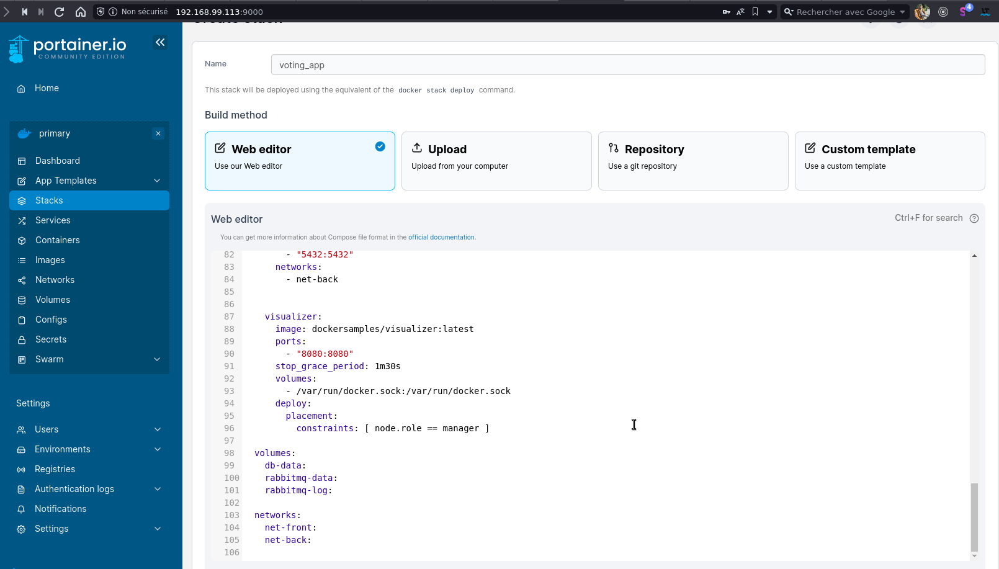

## Architecture

- front-api: front-end permettant à un utilisateur de voter.
- api: back-end réceptionnant les votes.
- front-socket: front-end permettant de visualiser les résultats.
- socket: back-end mettant à disposition les résultats
- db: database dans laquelle sont stockés les votes
- rabbitmq: broker de messagerie qui récupère les votes depuis api et transmet les résultats à la partie socket.


```
├── docker-compose-prod.yml
├── docker-compose.yml
├── docker-stack.yml
├── api
│   ├── app
│   ├── Dockerfile
│   ├── package.json
│   ├── package-lock.json
│   └── server.js
├── front-api
│   ├── build
│   ├── Dockerfile
│   ├── nginx.conf
│   ├── package.json
│   ├── package-lock.json
│   ├── public
│   ├── README.md
│   └── src
├── front-socket
│   ├── Dockerfile
│   ├── nginx.conf
│   ├── package.json
│   ├── package-lock.json
│   ├── public
│   ├── README.md
│   └── src
├── README.md
└── socket
    ├── Dockerfile
    ├── package.json
    ├── package-lock.json
    └── server.js
```

### Lancer le projet (En mode Dev)
```
$ docker-compose up --force-recreate --build
```

[//]: # (### Clean)
[//]: # (```)
[//]: # ($ docker container rm $&#40;docker container ps -aq&#41;)
[//]: # ($ docker image rm -f $&#40;docker image ls | grep voting-app&#41;)
[//]: # (```)


### Swarm - Lancer le projet (En mode Production)

Build project
``` 
$ docker-compose -f docker-compose-prod.yml build
```

Push DockerHub
```
$ docker-compose -f docker-compose-prod.yml push
```

Si les machines sont déjà créées:
```
$ docker-machine start node1
$ docker-machine start node2
$ docker-machine start node3
```

Si non, créer 3 hôtes nommés node1, node2, node3
```
$ docker-machine create --driver virtualbox node1
$ docker-machine create --driver virtualbox node2
$ docker-machine create --driver virtualbox node3
```

Utilisez SSH pour vous connecter à vos machines
```
$ docker-machine ssh node1
$ docker-machine ssh node2
$ docker-machine ssh node3
```

Nous pouvons initialiser le swarm sur le node1
```
node1@:$ docker swarm init --advertise-addr <IP_NETWORK_INTERFACE>
```

Ou récupérer le token pour les machines workers
```
node1@:$ docker swarm join-token worker
```

Installer nano dans Boot2Docker (node1) et copier/coller le docker-stack.yml
```
node1@:$ tce-load -wi nano docker-stack.yml
```

Autoriser d'autres machines à se joindre au Swarm
```
node2@:$ docker swarm join --token <TOKEN_ID>
node3@:$ docker swarm join --token <TOKEN_ID>
```

Lancer le projet
```
node1@:$ docker stack deploy -c docker-stack.yml voting-app
node1@:$ docker stack ls
node1@:$ docker stack ps voting-app
node1@:$ docker service ls
```


### Swarm - Lancer le projet (mode Production) avec Portainer

```
node1@:$ curl -L https://downloads.portainer.io/ce2-16/portainer-agent-stack.yml -o portainer-agent-stack.yml
```

Lancer Portainer dans le node1 (manager)
```
node1@:$ docker stack deploy -c portainer-agent-stack.yml portainer
```

On va aller dans Stack, on voit les Stacks qui sont déployées sur notre cluster.\
On va pouvoir en déployer d'autres directement avec Ad Stack.

Et ce qu'on va faire maintenant, c'est déployer la voting app.
On va récupérer ici le fichier Docker Stack.\
Et on va faire Deploy the Stack.



